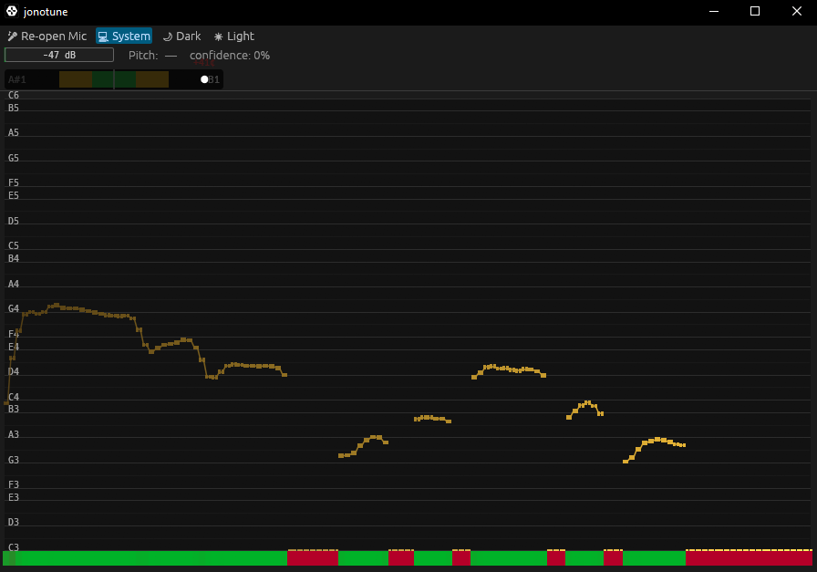

# jonotune 🎤

A real-time pitch monitor to help you sing in tune. It listens to your
microphone, detects the note you're singing, and shows you how close you
are — like a tuner, but with a scrolling pitch history so you can see
where you drifted.

Runs as a native desktop app **and** as a web page. Built with
[egui](https://github.com/emilk/egui).



**Top bar:**

- **VU meter** — mic input level in dB, green→yellow→red.
- **Pitch readout** — frequency in Hz + nearest note name + confidence
  percentage.
- **Tuning bar** — horizontal slider. The colored dot shows your cents
  offset from the nearest note. Green zone (±10¢): in tune. Yellow
  (±25¢): close. Red: you're off. The bar dims in silence instead of
  disappearing.

**Main area:**

- **Pitch history** — scrolling spectrograph, C3 to C6, log scale.
  Amber trail fades with age. Brighter = higher confidence.
- **Confidence strip** — thin bar at the bottom, green when the detector
  is sure, red when it's guessing.

## Running it

### Native (desktop)

```sh
cargo run --release
```

You need a microphone. It opens the default input device automatically.

**Linux:** you'll need some system libraries for cpal/egui:

```sh
sudo apt-get install libxcb-render0-dev libxcb-shape0-dev \
  libxcb-xfixes0-dev libxkbcommon-dev libssl-dev \
  libasound2-dev
```

### Web (browser)

```sh
trunk serve
```

Then open `http://localhost:8080` (add `#dev` to skip the service worker
cache).

To build for deployment:

```sh
trunk build --release   # outputs to dist/
```

## Architecture

```
microphone ──► cpal ──► ringbuf ──► YIN detector ──► Spectrograph ──► egui
                              │                          │
                              └──► VU meter              └──► Tuning bar
```

| File | Does |
|------|------|
| `src/audio.rs` | Platform audio capture trait + native (cpal) backend + wasm skeleton |
| `src/pitch.rs` | YIN pitch detector with unit tests |
| `src/spectrograph.rs` | Ring-buffer pitch history + egui widget (grid, trail, confidence bar) |
| `src/app.rs` | Wires everything together: audio → detection → display. VU meter, tuning bar, note helpers |
| `src/main.rs` | Native entry point |
| `src/lib.rs` | Wasm entry point |

## License

MIT OR Apache-2.0 (same as egui).
